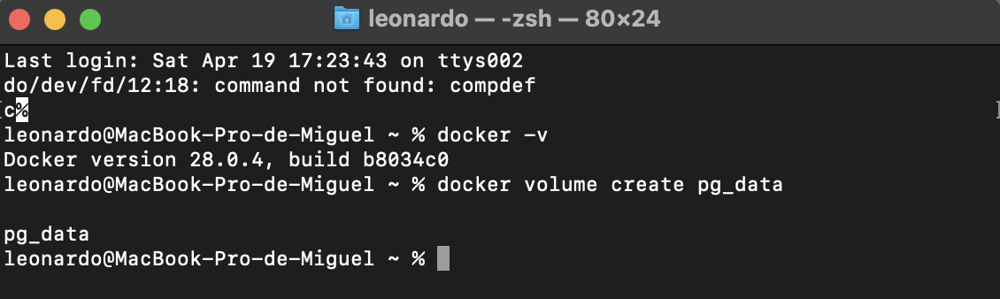

# Practica SQL con datos con y sin volúmenes

## 1. Titulo

*Practica No 3*: Gestión de bases de datos mediante Docker y TablePlus

## 2. Tiempo de duración

Se utilizo un tiempo de 2 horas para la realización de esta práctica

## 3. Fundamentos:

En esta práctica, se aprenderán conceptos básicos sobre la manipulación de bases de datos PostgreSQL usando dos herramientas como es TablePlus, como una interfaz gráfica para trabajar con bases de datos  utilizando comandos SQL , y la terminal en MacOS.

Se realizó la creación de tablas, inserción de datos, y validación de registros mediante la interfaz gráfica. Permitiéndome reforzar habilidades tanto en el entorno gráfico como en la terminal, facilitando su comprensión de la estructura y manipulación de bases de datos.

Entre los comandos utilizados se encuentran:

- `docker pull postgres`: Descargar la imagen oficial de PostgreSQL.
    
- `docker run --name postgres-db -e POSTGRES_PASSWORD=1234 -p 5432:5432 -d postgres`: Crear y ejecutar un contenedor con PostgreSQL.
    
- `docker ps`: Ver contenedores en ejecución.
    
- `docker exec -it postgres-db psql -U postgres`: Acceder al contenedor para usar `psql`.
    
- `\q`: Salir de la consola de PostgreSQL.
    
- `docker stop postgres-db`: Detener el contenedor.
    
- `docker start postgres-db`: Iniciar el contenedor.
    
- `docker rm -f postgres-db`: Eliminar el contenedor (si es necesario limpiar).

## 4. Conocimientos previos.

Para realizar esta práctica es necesario conocer sobre PostgreSQL, que es un sistema gestor de bases de datos relacional de código abierto, según **The PostgreSQL Global Development Group(2023)**, PostgreSQL se destaca por su robustez, estabilidad y capacidad para manejar grandes volúmenes de datos de forma segura y eficiente.

También se debe manejar TablePlus, una herramienta moderna para la gestión de bases de datos, que ofrece una interfaz intuitiva para conectarse, consultar y modificar información de forma visual. Como indica **TablePlus (2024)**, esta aplicación es compatible con múltiples motores de bases de datos y facilita el trabajo de los desarrolladores y administradores.

Además, es necesario comprender el uso de volúmenes en Docker, que permiten almacenar datos de forma persistente incluso después de eliminar un contenedor. De acuerdo con **Docker Inc. (2024)**, los volúmenes son ideales para separar los datos del entorno de ejecución, mejorando la gestión y respaldo de la información.

## 5. Objetivos a alcanzar

- Conectarse a una base de datos PostgreSQL desde TablePlus y Terminal.
    
- Validar operaciones realizadas desde una herramienta en la otra.

- Comprender el manejo de información de la base de datos mediante le uso de volúmenes mediante Docker.

## 6. Equipo necesario:

- Computador con sistema operativo **MacOS:** 13.7.1

- **Procesador:** 2,3 GHz Intel Core i5

- **Memoria:** 8 GB

- Table-Plus

- Teminal de MAC

- Conexión a Internet para el material de apoyo

## 7. Material de apoyo.

- Documentación oficial de Docker

- Documentación oficial de Postgres SQL

- Videos Material de Apoyo (EVA)

- Manual de usuario de TablePlus

## 8. Procedimiento

### **Parte 1: Base de datos sin volumen**

**Paso 1:** Crear un contenedor PostgreSQL con el nombre server_db .

Figura 1. Comando **"docker run --name server_db -e POSTGRES_PASSWORD=1611 -p 5434:5432 postgres"**.

  

**Paso 2:** Conectar a un administrador de base de datos (como TablePlus) al contenedor server_db.

Figura 2. **"Configuración de Conexión en TablePlus"**.

  

**Paso 3:** - Crear una base de datos llamada test:

Figura 3. Comando SQL **"CREATE DATABASE test ; "**.

  

**Paso 4:** En la base de datos test, crear una tabla llamada customer con los campos: id, fullname y status.

Figura 4. Comando SQL  **"CREATE TABLE"**..

  
  

**Paso 5:** - Insertar un registro en la tabla customer.

Figura 5. Comando SQL **"INSERT INTO"**.

  

  
**Paso 6:** Detener y eliminar el contenedor server_db.

Figura 6. Comando **"Docker stop y Docker rm"**.

  

  

**Paso 7:** Volver a crear el contenedor PostgreSQL con el mismo nombre server_db.

Figura 7. Comando **"docker run "**.

  

  

**Paso 8:** Conectarse nuevamente desde el administrador de base de datos.

Figura 8. Ventana **"TablePlus "**.

  
  

**Paso 9:** Verificar que la base de datos test ya no existe, demostrando que los datos no se han conservado.

Figura 9. Ventana TablePlus **"database"**.

  

### **Parte 2: Base de datos con volumen**
  

**Paso 1:** Crear un volumen en Docker con el comando:

Figura 1. Comando **"docker volume create pg_data"**.

  

  

**Paso 2:** Crear un contenedor PostgreSQL con el nombre server_db2, asociando el volumen creado

  

Figura 2. Comando **"docker run ...pg data:/var/lib/postgresql/data"**.

  

**Paso 3:** Conectar a un administrador de base de datos (como TablePlus) al contenedor server_db2

  

Figura 3. **"Configuración de Conexión en TablePlus"**.

  

  

**Paso 4:** - Crear una base de datos llamada test:

  

Figura 4. Comando SQL **"CREATE DATABASE test ; "**.

  

**Paso 5:** En la base de datos test, crear una tabla llamada customer con los campos: id, fullname y status

Figura 5. Comando SQL  **"CREATE TABLE"**..

  
  

**Paso 6:** - Insertar un registro en la tabla customer.

Figura 6. Comando SQL **"INSERT INTO"**.

  

  

**Paso 7:** Detener y eliminar el contenedor server_db2.

Figura 7. Comando **"Docker stop y Docker rm"**.

**Paso 8:** Volver a crear el contenedor PostgreSQL con el mismo nombre server_db2 y usando el volumen pgdata nuevamente.

Figura 8. Comando **"docker run "**.

  

  

**Paso 9:** Conectarse nuevamente desde el administrador de base de datos.

  

Figura 9. Ventana **"TablePlus "**.

  
  

**Paso 10:** Verificar que la base de datos test y los registros han persistido

  

Figura 10. Ventana TablePlus **"Test"**.

## 9. Resultados esperados:

La práctica me permitió conectarme y gestionar una base de datos PostgreSQL utilizando tanto **TablePlus** como **Terminal**, validando las operaciones realizadas en ambas herramientas. Aprendí a crear tablas, insertar datos, y observé cómo los cambios realizados en un entorno se reflejaban en el otro en tiempo real.

Además, comprendí el manejo de datos en la base de datos mediante el uso de **volúmenes en Docker**, lo que permitió conservar la información de la base de datos incluso después de detener o eliminar los contenedores.

En resumen, fue una práctica útil para familiarizarme con la gestión de bases de datos en entornos gráficos y de línea de comandos, y entender cómo Docker puede facilitar la persistencia de datos en contenedores.

## 10. Bibliografía

- Docker Inc. (2024). _Manage data in Docker_ (Volumes). https://docs.docker.com/storage/volumes/

- TablePlus. (2024). _Modern, native tool for relational databases_. [https://tableplus.com/](https://tableplus.com/)

- The PostgreSQL Global Development Group. (2023). _PostgreSQL 16 documentation_. [https://www.postgresql.org/docs/](https://www.postgresql.org/docs/)

